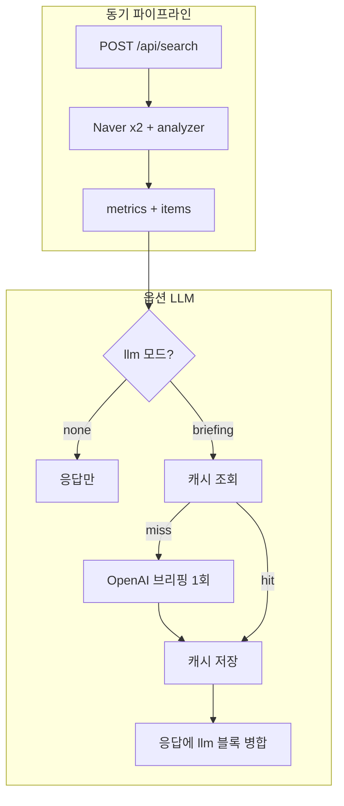

# OpenAI 하이브리드 연동 설계안

기존 **규칙·통계·Kiwi** 파이프라인은 유지하고, **문장 품질·종합 인사이트**만 LLM에 맡기는 구조를 권장한다.  
목표: **비용·지연·재현성**을 통제하면서 데스크용 가치만 올린다.

---

## 1. 원칙

| 항목 | 권장 |
|------|------|
| LLM 호출 시점 | 검색 직후 **자동 전체 호출은 지양**. 기본은 **옵트인**(버튼) 또는 **검색 1회당 최대 1회**(브리핑만). |
| 입력 | **제목 + 네이버 description** 위주. 본문 크롤링은 정책·저작권 검토 후 별도. |
| 모델 | **`gpt-4o-mini`** (또는 동급 소형)로 시작. 품질 부족 시에만 상위 모델. |
| 출력 | **JSON 스키마 고정**으로 파싱 실패·할루시네이션 완화. |

---

## 2. API 엔드포인트 설계

### 2.1 기존 `POST /api/search` (변경 최소)

- **유지**: 네이버 2회 호출 + `analyzer` + `journalist_insights` 전부 그대로.
- **선택적 확장** (쿼리 바디에 플래그):

```json
{
  "query": "…",
  "sort": "sim",
  "display": 30,
  "llm": "none"
}
```

- `llm` 값:
  - **`none`** (기본): LLM 호출 없음. 비용 0.
  - **`briefing`**: 검색 완료 후 **브리핑 1통**만 생성 (아래 3.1).
  - **`full`** (선택): `briefing` + 상위 K개 기사 **요약 문장 교체** (비용↑).

> 비용 통제상 **`none` 기본**을 권장한다.

### 2.2 전용 엔드포인트 (권장: UI에서 “AI 브리핑” 버튼)

**`POST /api/llm/briefing`**

- **역할**: 이미 받아 둔 검색 결과 없이도, **프론트가 넘긴 요약 컨텍스트**만으로 브리핑 생성 가능 (재검색 없이).
- **바디 예시**:

```json
{
  "query": "삼성전자",
  "sort": "sim",
  "display": 30,
  "metrics_digest": { }
}
```

- `metrics_digest`는 **백엔드가 내려준 `metrics` 중 일부만** 복사해 보내도 되고, **프론트만으로는 비권장** (위조 방지는 서버에서 재검증 또는 세션 캐시 키 사용).

**더 안전한 패턴**: 검색 직후 서버가 **`search_id` + Redis/메모리에 스냅샷** 저장 → `POST /api/llm/briefing`에는 `{ "search_id": "uuid" }`만 보내고 서버가 저장된 `metrics`로 LLM 입력 구성.

### 2.3 (선택) `POST /api/llm/article-summaries`

- **역할**: 상위 K개 기사에 대해 **추출형 요약 대체**가 아닌 **생성형 한 줄 + 불릿**.
- **바디**: 기사 식별자 배열 또는 `search_id` + 인덱스 목록.
- **호출 빈도 제한**: K ≤ 3, 사용자당 분당 N회 (레이트 리밋).

---

## 3. 프롬프트 설계

### 3.1 통합 브리핑 (1회 호출, 비용 효율 최고)

**시스템**

```
당신은 한국 뉴스 데스크 보조다. 아래는 네이버 뉴스 검색 API로 얻은 표본과 자동 집계 수치다.
추측하지 말고, 주어진 수치·제목 범위 안에서만 서술한다. JSON만 출력한다.
```

**유저 (구조화 입력, 토큰 절약)**

- `query`, `display`, `정렬`
- `상위 언론사 5개 (비율)`
- `일자별 건수 요약` (최대 5버킷)
- `상위 키워드 10개`
- `기자 인사이트 요약` (이미 계산된 필드만: Jaccard, HHI 경고 여부, 최초 보도 시각 등)
- `대표 제목 5~8개` (제목만, 링크 없어도 됨)

**출력 JSON 스키마 (예시)**

```json
{
  "headline": "한 줄로 이 이슈를 설명하면",
  "angles": ["취재 각도 1", "취재 각도 2", "취재 각도 3"],
  "cautions": ["수치/표본 한계에 대한 주의 한 줄"],
  "follow_up_questions": ["후속 질문 1", "후속 질문 2"]
}
```

### 3.2 기사별 요약 (K ≤ 3, 호출 1회에 배치)

**시스템**

```
한국어 뉴스 제목·요약문만 보고 각 기사를 2~3문장으로 요약한다. 사실 추가·추측 금지. JSON 배열만 출력한다.
```

**유저**

- 기사 배열: `[{ "id": 0, "title": "…", "snippet": "…" }, …]`

**출력**

```json
[
  { "id": 0, "summary": "…", "bullets": ["…", "…"] }
]
```

한 번의 completion으로 **여러 기사**를 처리해 **호출 횟수**를 줄인다.

---

## 4. 비용·지연 줄이기

### 4.1 배치(Batch)

- **브리핑**: 검색당 **LLM 1회**가 목표. 기사별로 나누지 않는다.
- **요약**: 가능하면 **한 프롬프트에 K개 기사** (위 3.2).

### 4.2 캐시

| 키 구성 요소 | 설명 |
|--------------|------|
| `query` 정규화 | 공백 trim, 소문자(영문만 해당 시) |
| `sort`, `display` | 그대로 |
| `digest_hash` | 서버가 만든 `metrics` 중 LLM에 넣는 필드만 JSON 직렬화 후 SHA-256 |
| `prompt_version` | 프롬프트/모델 바뀌면 버전 올려 캐시 무효 |

**TTL**: 15~60분 (뉴스는 변동 큼. 너무 길면 의미 없음).

**저장소**

- MVP: **프로세스 메모리** `dict` + TTL (단일 인스턴스만).
- 운영: **Redis** 권장 (여러 워커·재시작 대비).

### 4.3 토큰 상한

- 제목·스니펫은 **기사당 글자 수 제한** (예: 제목 120자, 스니펫 400자).
- `metrics_digest`는 **숫자·상위 N개만** (전체 JSON 통째로 넣지 않기).

### 4.4 실패 시

- 타임아웃·429·5xx → **기존 규칙 기반 요약/인사이트만 표시**, LLM 블록은 “일시 불가” 메시지.

---

## 5. 환경 변수

```
OPENAI_API_KEY=sk-...
OPENAI_MODEL=gpt-4o-mini
LLM_CACHE_TTL_SECONDS=1800
LLM_MAX_ARTICLES_PER_BATCH=3
```

`backend/.env.example`에 **이름만** 추가하고, 실제 키는 커밋하지 않는다.

---

## 6. 흐름도 (요약)



---

## 7. 구현 순서 제안

1. `OPENAI_API_KEY` 읽기 + **`POST /api/llm/briefing`**만 구현 (입력은 `search_id` 또는 `metrics_digest` 최소).
2. 캐시(메모리) + `prompt_version`.
3. 프론트에 **“AI 브리핑 생성”** 버튼 → 로딩·에러 처리.
4. 필요 시 **기사 배치 요약** 엔드포인트 추가.

---

## 8. 준수 사항 (참고)

- 네이버 API **이용약관**·뉴스 **재전송·저작권** 관련 조항 확인.
- 사용자 데이터·로그에 **API 키·원문 전체** 남기지 않기.

이 문서는 구현 시 그대로 이슈/PR 설명에 붙여도 된다.
